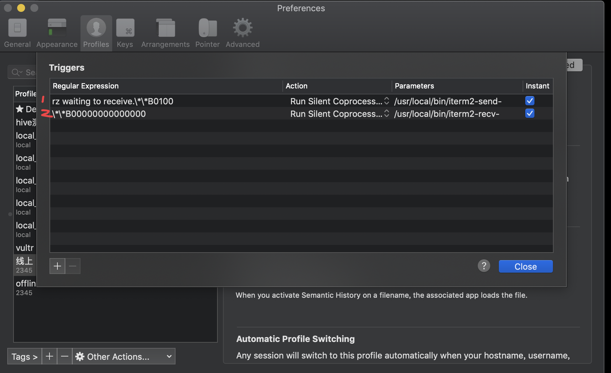

# 项目介绍

在macOS下让iterm2支持Zmodem协议
实现与服务器进行便捷的文件上传和下载操作。


# 步骤

1.安装支持rz和sz命令的lrzsz：`brew install lrzsz`

2.在本地/usr/local/bin/目录下保存iterm2-send-zmodem.sh 和iterm2-recv-zmodem.sh两个脚本

```bash
cp -f ./iterm2-* /usr/local/bin/
```

3.设置可执行权限

```bash
chmod +x /usr/local/bin/iterm2-*
```

4.设置Iterm2的Tirgger特性，profiles->default->editProfiles->Advanced中的Tirgger

添加两条trigger，分别设置 Regular expression，Action，Parameters，Instant如下：

```
1.第一条
        Regular expression: rz waiting to receive.\*\*B0100
        Action: Run Silent Coprocess
        Parameters: /usr/local/bin/iterm2-send-zmodem.sh
        Instant: checked
2.第二条
        Regular expression: \*\*B00000000000000
        Action: Run Silent Coprocess
        Parameters: /usr/local/bin/iterm2-recv-zmodem.sh
        Instant: checked
```


